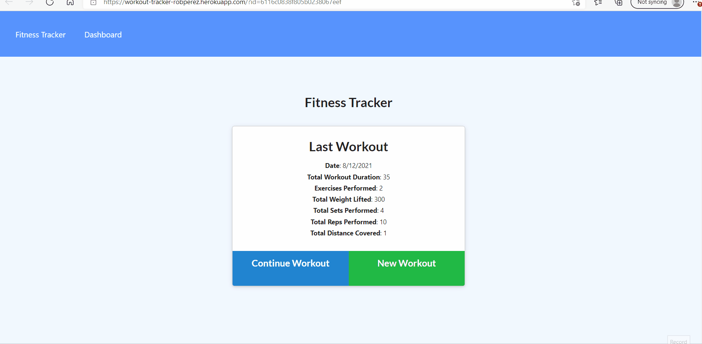

# The People's Blog

## Description

An app that allows users to track their workouts by adding exercises as they do them. Displays charts for the 7 most recent workouts.

The code and all relevant files can be found at [github.com/perez-rob/Workout-Tracker](https://github.com/perez-rob/Workout-Tracker).

The deployed application can be accessed here: [workout-tracker-robperez.herokuapp.com/](https://workout-tracker-robperez.herokuapp.com/)

## Table of Contents

- [Installation](#installation)

- [Features](#features)

- [Usage](#usage)

- [Credits](#credits)

- [Questions](#questions)

- [License](#license)

## Installation

No installation required. Just go to [workout-tracker-robperez.herokuapp.com/](https://workout-tracker-robperez.herokuapp.com/) to use.

## Features

The Workout Tracker has the following features:

- Create new workouts or add to the most recent one
- Add 'Cardio' or 'Resistance' exercises with a variety of details
- View graphs of the total duration and total weight lifted for the seven most recent workouts
- All data stored in a remote MongoDB

## Usage

- From the homepage, select 'Continue Workout' to add exercises to the most recent workout or 'New Workout' to start adding exercises to a new one.
- Then select your exercise type and fill out the information.
- Click 'Add Exercise' to add it to your workout or 'Complete' to add it and return to the homepage.
- Clicking the 'Dashboard' link in the upper left will take you to graphs of your seven most recent workouts.

## Credits

Solo project for GATech Coding Bootcamp. Starter good for the UI was provided.
by Rob Perez

- [Portfolio Page](https://www.robperez.net)
- rob@robperez.net
- 404.317.5336

## Questions

If you have any questions about the repo, open an issue or contact me directly at bob.w.perez@gmail.com. You can find more of my work at [github/perez-rob](https://github.com/perez-rob).

## License

This project is licensed under the [GPL v3 License](https://www.gnu.org/licenses/gpl-3.0).
